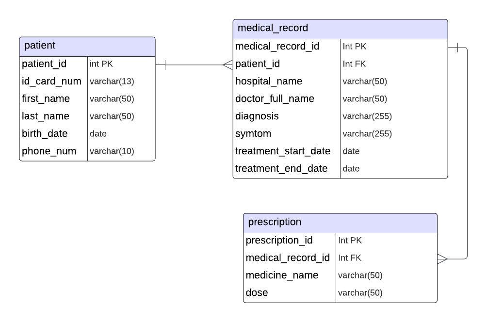

# __Medical Record Application__

This project showcases the adeptness in crafting a RESTful API with Flask, designed to handle medical data operations within a PostgreSQL database, including Create, Read, Update, and Delete (CRUD) functionalities.

### __Technologies:__
- Python: Primary programming language utilized in this project.
- Flask: Framework for building RESTful APIs.
- PostgreSQL: Database management system.
- Docker: Containerization technology for seamless deployment.
- Prefect: Data orchestrator utilized to showcase the creation of data pipelines, ensuring efficient data flow management.

### __Data Model:__
- Patient table: Stores patient information, encompassing personal details and contact information.
- Medical record table: Records detailed information about each visit a patient makes, including diagnostic data, treatment start and end dates.
- Prescription table: Contains prescriptions issued by doctors to patients for each medical record, specifying medications and dosage instructions.

