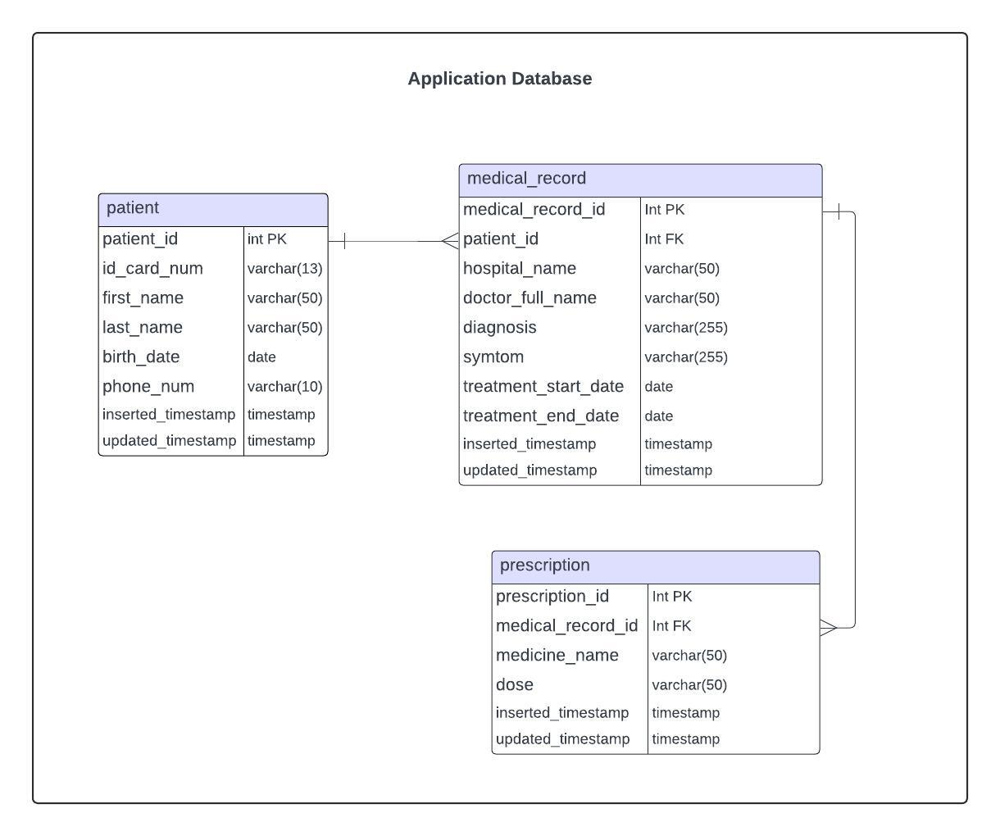
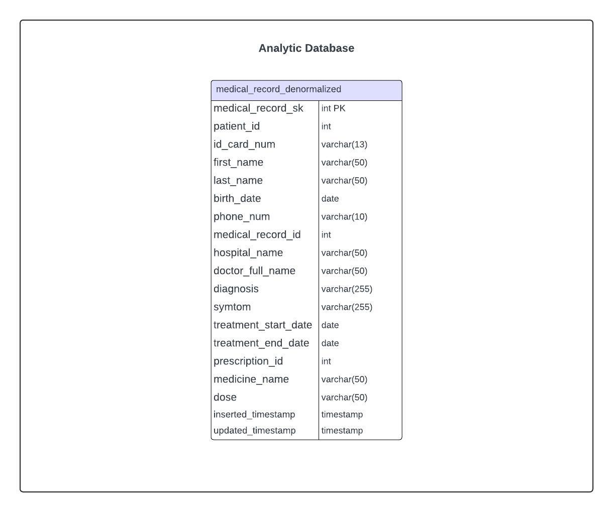

# __Medical Record Application__
## __Overview__
This project showcases capability to craft RESTful API with Flask to handle medical data operations within a PostgreSQL database, as well as capability to create data pipelines for transferring application data to an analytic database facilitating data analysis.

## __Technologies__
- Python: Primary programming language utilized in this project.
- Flask: Framework for building RESTful APIs.
- PostgreSQL: Database management system.
- Docker: Containerization technology for seamless deployment.
- Prefect: Data orchestrator utilized to showcase the creation of data pipelines, ensuring efficient data flow management.
- Sling: Running Extract & Load tasks.

## __Data Model__
### __Application Data Model__
- Patient table: Stores patient information, encompassing personal details and contact information.
- Medical record table: Records detailed information about each visit a patient makes, including diagnostic data, treatment start and end dates.
- Prescription table: Contains prescriptions issued by doctors to patients for each medical record, specifying medications and dosage instructions.

### __Analytic Data Model__
- Medical Record Denormalized: Stores pre-joined data from Patient, Medical record, and Prescription tables for data analysis.

## __Running Instructions__
__Prerequisite:__ Ensure Docker is installed on your machine. 
1. Open your terminal and navigate to the root directory of the project.
2. Execute `docker compose up -d` in your terminal to start all services.
3. Confirm that all services are running by executing `docker ps`. There should be 4 services running.
4. After all services are started, you can test the API using the Postman collection located in the postman_collection directory.
5. Import sample data to the application database by executing `docker exec -it prefect python /root/.prefect/initialAppData.py`.
6. Once the initialAppData.py is executed, monitor the execution status in the Prefect UI by accessing http://localhost:4200 on your web browser.
7. Run the data pipeline job to load data from the application database to the medical_record_denormalized table in the analytic DB by executing `docker exec -it prefect python /root/.prefect/loadAnalyticDB.py`.
8. Once the loadAnalyticDB.py is executed, check the execution status in Prefect UI by accessing http://localhost:4200 on your web browser.
9. Verify if the medical_record_denormalized table has been loaded by executing `docker exec -it analytic-DB psql -U postgres -d postgres` to access psql prompt and then executing `select * from analytic.medical_record_denormalized;`.
10. Execute `docker compose down` to stop all containers.
